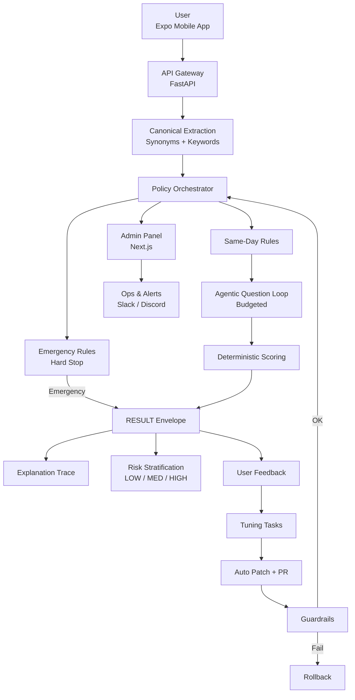

# Pre-Triage Agentic AI

Policy-driven, explainable, safety-first symptom pre-triage system.

Medical disclaimer: This system is not a diagnostic tool and does not replace a physician.
It provides pre-triage guidance only, focusing on safety, routing, and risk awareness.

## What Is This?

Pre-Triage Agentic AI helps users:

- Describe symptoms in free text
- Receive safe, explainable guidance
- Get routed to the right specialty
- Detect emergency or same-day risk early

This is not a generic chatbot. It is a policy-controlled orchestration layer with audit logs,
guardrails, and rollback support.

## Default Integration Path

- Backend runtime entrypoint: `app.main`
- Mobile/backend API path: `POST /v1/triage/turn`
- Primary API contract: `docs/openapi_orchestrator.yaml`
- Legacy reference contract: `openapi.yaml` (deprecated)
- `app.api_v5` is experimental and not the default production path

## Core Philosophy

| Principle | Enforcement |
| --- | --- |
| Safety first | Emergency rules hard-stop all flows |
| Explainability | Deterministic explanation trace |
| Auditability | Full session + event replay |
| Control | Rules and policy over black-box behavior |
| Iteration | Feedback -> tuning -> PR -> guardrail |

## System Architecture



## Envelope Model

Every response is one explicit envelope:

- `EMERGENCY`: Immediate urgent action required (hard stop)
- `SAME_DAY`: Same-day evaluation recommended
- `QUESTION`: Clarifying question turn
- `RESULT`: Final guidance with risk and explainability

## Clinical Safety Layers

1. Emergency rules engine
- Runs before all other modules
- Deterministic hard-stop rules
- No override path

2. Same-day rules
- Soft urgency gate
- Can continue with bounded questioning

3. Risk stratification (`LOW`/`MEDIUM`/`HIGH`)
- Independent from emergency
- Uses symptom patterns, confidence, duration, and optional profile signals

## Explainability

Each `RESULT` includes a deterministic trace:

- Extracted symptom canonicals
- Why the top specialty scored highest
- Why questioning stopped
- Same-day or safety decisions
- Risk level, score, and reasons

## Facility Discovery (Ethical)

- Read-only informational list
- Specialty and location based
- No doctor ranking or recommendation pressure
- Explicit non-directive disclaimer

## Tech Stack

Backend:

- FastAPI
- Deterministic rules and orchestration
- Supabase (Postgres)
- GitHub Actions for alerts and operations

Frontend:

- Expo (mobile)
- Next.js (admin and ops)

Ops and safety:

- Session/event logging
- Config-diff tuning
- Guardrail checks
- Automatic rollback
- Kaggle ingest automation (`docs/KAGGLE_INGEST_AUTOMATION.md`)
- Slack/Discord alerts

## Admin and Observability

Admin surfaces include:

- Risk-aware session list and sorting
- Confidence and risk badges
- Full event timeline
- Health overview (`INFO`/`OK`/`WARN`/`CRIT`)
- Low-confidence and high-risk trend sparklines

## Continuous Improvement Loop

```text
User Feedback
  -> Tuning Task
  -> Config Patch
  -> Pull Request
  -> Guardrail Check
  -> Deploy or Rollback
```

## What This Is Not

- Not a diagnosis engine
- Not a doctor ranking platform
- Not a black-box LLM chatbot
- Not a treatment decision maker

## Use Cases

- Patients unsure where to go first
- Tele-health pre-screening
- Public health routing optimization
- Reducing unnecessary ER visits
- Early detection of dangerous symptoms

## Ethics and Compliance

- Explicit medical disclaimers
- No treatment advice
- No doctor scoring
- Privacy-aware logs (hashed IP + session IDs)

## 90-Second Demo Flow

1. User enters free-text symptoms
2. Emergency scenario shows hard stop
3. Same-day and question loop runs when needed
4. Result shows specialty, risk, and explainability
5. Admin panel shows trace, trends, and health status

## Status

- Hackathon-ready
- Production-oriented MVP
- Safety-review friendly

## Short Pitch

Healthcare systems lose time and capacity because patients often do not know where to go first.
Some panic and visit emergency unnecessarily, others delay despite warning signs.

Pre-Triage Agentic AI solves this with a policy-first routing layer.
It does not diagnose. It determines:

- Is this an emergency?
- Should the user be seen today?
- Which specialty is most appropriate?
- How risky the current state is (`LOW`/`MEDIUM`/`HIGH`)

What makes it different is control and safety:

- Hard emergency stop rules
- Budgeted agentic questioning
- Deterministic scoring
- Full explainability and audit trail
- Guardrails, alerting, and rollback

It does not replace doctors.
It helps patients reach the right care, at the right time, more safely.
