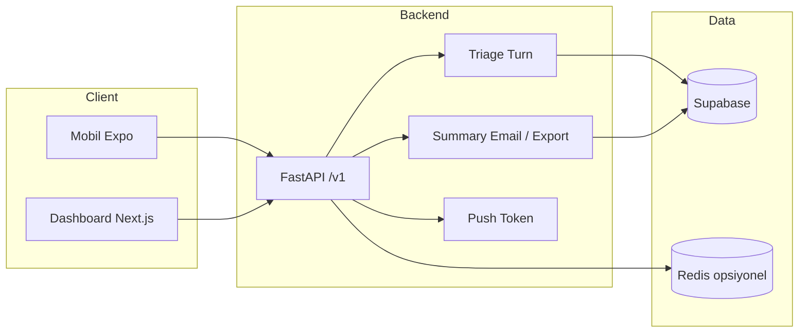
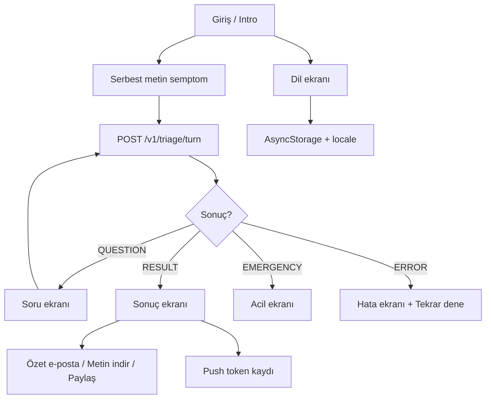

# Mimari özet

TriAIge: ön-triyaj asistanı — backend, mobil (Expo) ve dashboard (Next.js) bileşenleri.

---

## Yüksek seviye akış

---

## Mobil (Expo) akışı

- **i18n:** AsyncStorage + expo-localization; TR/EN/DE/RU/AR; Arapça RTL.
- **API:** triage turn, feedback, send-summary, export-summary, push-token.

---

## Backend endpoint’ler (özet)

| Prefix / Endpoint | Açıklama |
|-------------------|----------|
| `POST /v1/triage/turn` | Oturum başlatma, cevap, sonuç (tek endpoint). |
| `POST /v1/triage/feedback` | Kullanıcı oylaması (up/down). |
| `POST /v1/triage/send-summary` | Özet e-postası (session_id, email, locale). Rate limit: 5/dk (export-summary ile paylaşır). |
| `POST /v1/triage/export-summary` | Özet metin (payload, locale). Rate limit: 5/dk (send-summary ile paylaşır). |
| `POST /v1/triage/push-token` | Expo Push Token kaydı. |
| `GET /v1/facilities` | Tesis keşfi. |
| `GET /health` | Liveness + Supabase durumu. |

---

## Veri (Supabase)

- **triage_sessions_v5 / triage_sessions:** Oturum kayıtları; send-summary session’ı buradan okur.
- **Feedback / admin tabloları:** Dashboard ve analitik için.

Redis: rate limit (triage, feedback, send-summary, export-summary) için opsiyonel; yoksa in-memory kullanılır. send-summary ve export-summary IP başına 5/dk paylaşımlı limit kullanır.
