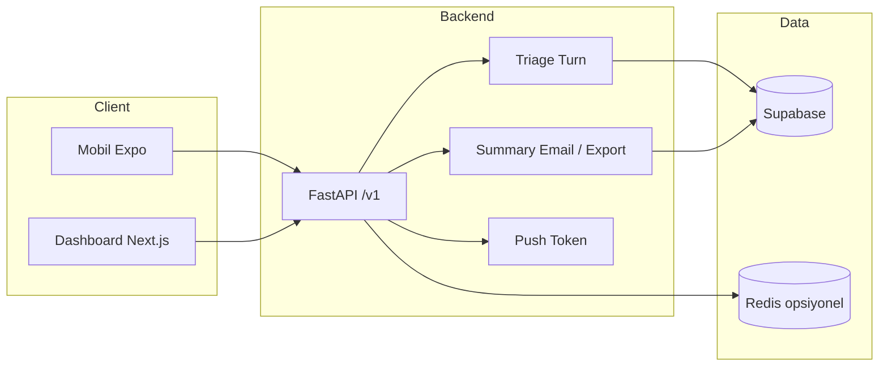
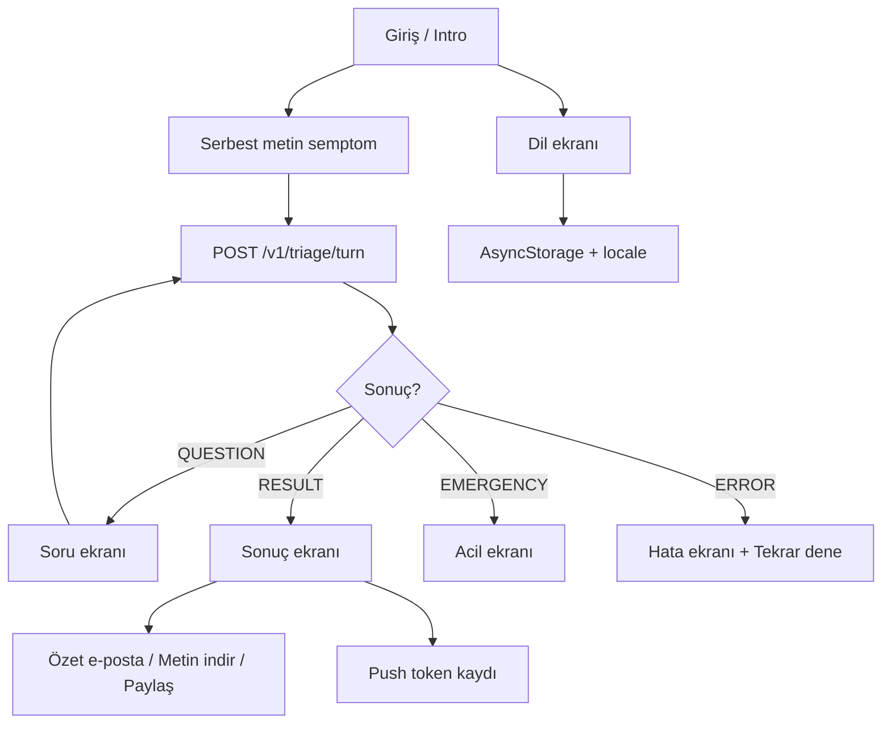
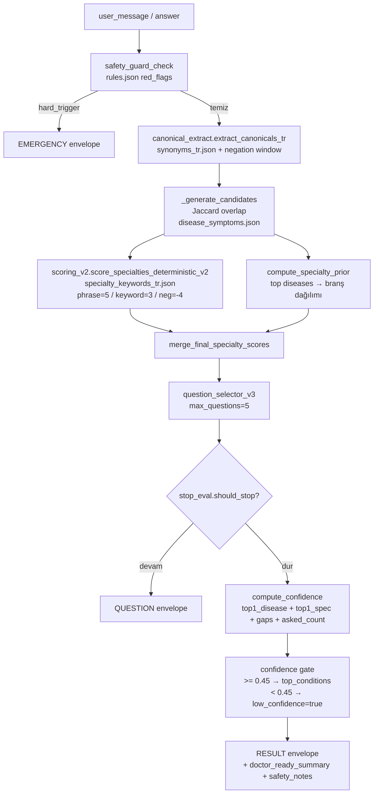
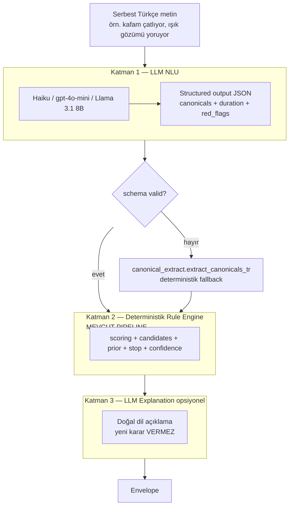

# Mimari özet

Dotshub: ön-triyaj asistanı — backend, mobil (Expo) ve dashboard (Next.js) bileşenleri.

---

## Yüksek seviye akış

---

## Mobil (Expo) akışı

- **i18n:** AsyncStorage + expo-localization; TR/EN/DE/RU/AR; Arapça RTL.
- **API:** triage turn, feedback, send-summary, export-summary, push-token.

---

## Backend endpoint’ler (özet)

| Prefix / Endpoint | Açıklama |
|-------------------|----------|
| `POST /v1/triage/turn` | Oturum başlatma, cevap, sonuç (tek endpoint). |
| `POST /v1/triage/feedback` | Kullanıcı oylaması (up/down). |
| `POST /v1/triage/send-summary` | Özet e-postası (session_id, email, locale). Rate limit: 5/dk (export-summary ile paylaşır). |
| `POST /v1/triage/export-summary` | Özet metin (payload, locale). Rate limit: 5/dk (send-summary ile paylaşır). |
| `POST /v1/triage/push-token` | Expo Push Token kaydı. |
| `GET /v1/facilities` | Tesis keşfi. |
| `GET /health` | Liveness + Supabase durumu. |

---

## Veri (Supabase)

- **triage_sessions_v5 / triage_sessions:** Oturum kayıtları; send-summary session’ı buradan okur.
- **Feedback / admin tabloları:** Dashboard ve analitik için.

Redis: rate limit (triage, feedback, send-summary, export-summary) için opsiyonel; yoksa in-memory kullanılır. send-summary ve export-summary IP başına 5/dk paylaşımlı limit kullanır.

---

## Triage Pipeline — Deterministik Akış (mevcut)

`POST /v1/triage/turn` içeri girdiğinde çalışan gerçek pipeline. Hiçbir
adımda LLM yoktur; aynı input → aynı output garantisi korunur.

**Kilit dosyalar:**

| Dosya | Rol |
|---|---|
| `backend/app/triage_engine.py` | Orkestratör — tüm adımları sırayla çalıştırır |
| `backend/app/canonical_extract.py` | Türkçe serbest metin → canonical liste |
| `backend/app/scoring_v2.py` | Specialty skorlama (phrase / keyword / negative) |
| `backend/app/confidence.py` | 4-bileşenli confidence formülü + label |
| `backend/app/emergency_router.py` | Hard/soft trigger değerlendirmesi |
| `backend/app/api/routes/triage.py` | HTTP yüzeyi + client_payload / event_payload split + confidence gate |

**Veri dosyaları** (`backend/app/data/` ve `config/`):

| Dosya | İçerik |
|---|---|
| `synonyms_tr.json` | 32 canonical, 128 varyant (A1 baseline, hedef 72+) |
| `specialty_keywords_tr.json` | 11 branş × keywords_tr + negative_keywords_tr |
| `disease_to_specialty.json` | 41 hastalık → specialty_id mapping |
| `kaggle_cache/disease_symptoms.json` | Hastalık → semptom listesi (candidate generator için) |
| `config/emergency_rules.json` | 13 emergency kuralı (STROKE, ACUTE_MI, ANAPHYLAXIS, ...) |
| `config/sameday_rules.json` | Same-day kuralları (şu an boş, A8'de doldurulacak) |
| `backend/app/data/red_flag_questions.json` | Red-flag takip soruları |

Kapsam detayı için `backend/scripts/audit_coverage.py` çalıştır; tam
boşluk analizi için `docs/medical/coverage_audit.md` (A1 session çıktısı).

---

## Hibrit Mimari — Gelecek Evrim

Deterministik iskelet korunacak; önüne "çevirmen" olarak bir LLM katmanı
konacak. Karar hâlâ kural tabanlı olacak.

**Tasarım ilkeleri:**

1. **LLM karar vermez, sadece çevirir.** Katman 1 yapılandırılmış JSON
   çıktı verir (canonical listesi). Medikal karar (branş, risk, safety
   note) deterministik rule engine'de kalır.
2. **Fallback daima deterministik.** LLM timeout, schema violation,
   rate limit, veya provider down → mevcut `canonical_extract` devreye
   girer. Sistem hiçbir zaman LLM'ye bağımlı değildir.
3. **Hallucination yoksunluğu.** LLM açık uçlu soru cevaplamaz; sıkı
   schema ile cevap verir, medikal iddia üretmez.
4. **PII redaction sınırı korunur.** Kullanıcı input'u LLM'ye gitmeden
   ÖNCE PII redaction uygulanır (`app.pii.redact_pii`).
5. **Regülatör uyumu.** SaMD (Software as Medical Device) sınıflandırması
   için karar katmanı auditable kalır — explainability trace değişmez.

Detaylar: `docs/LLM_INTEGRATION.md`.

---

## Design Principles

- **Determinism:** Aynı input → aynı output. Rule engine stateless,
  ağırlıklar JSON'da. Regresyon testi mümkün (`tests/golden_flows/`).
- **Explainability:** Her RESULT envelope'da `why_specialty_tr` +
  `explainability_trace`. Neden o branş, neden o risk, hangi kural
  tetikledi.
- **Safety-first:** `safety_guard_check` pipeline'ın ilk adımı.
  Emergency envelope hiçbir zaman confidence gate'lenmiş veya
  geciktirilmiş değildir.
- **Device-scoped ownership:** Session `x-device-id`'ye bağlı; başka
  cihazla erişim 403. `/triage/history` fail-closed.
- **Katmanlı rate limiting:** triage/feedback (20/dk), send-summary/
  export-summary (5/dk paylaşımlı), admin (60/dk). Redis veya in-memory.
- **Payload split:** `client_payload` (kullanıcıya) `_meta` stripped +
  confidence gate; `event_payload` (analytics'e) ham veri; `debug_patch`
  (admin dashboard) ham veri. Üçü birbirinden bağımsız.
- **PII redaction:** DB'ye yazılmadan önce `app.pii.redact_pii`. LLM
  entegrasyonu geldiğinde de aynı sınır korunur (LLM'ye PII gitmez).
- **Fail-open for non-critical:** Push token persist başarısız olursa
  dev modunda 201 (fail-open), prod'da 503. Webhook/push fire-and-forget.

---

## İlgili Dokümanlar

- `docs/LLM_INTEGRATION.md` — Stream B planı ve ADR'lar
- `docs/COVERAGE_EXPANSION.md` — Stream A planı ve session listesi
- `docs/medical/coverage_audit.md` — A1 baseline audit
- `docs/SCORING_SPEC.md` — scoring_v2 detayları
- `docs/CANDIDATE_GENERATOR_SPEC.md` — Jaccard overlap detayları
- `docs/FINAL_DECISION_SPEC.md` — specialty prior merge
- `docs/QUESTION_SELECTION_SPEC.md` — question_selector_v3
- `docs/SERBEST_METIN_PARSING.md` — canonical_extract detayları
