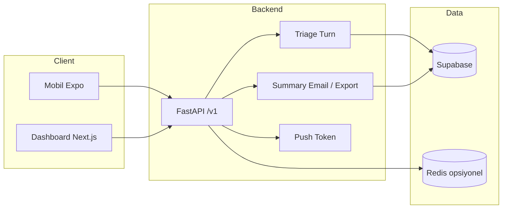
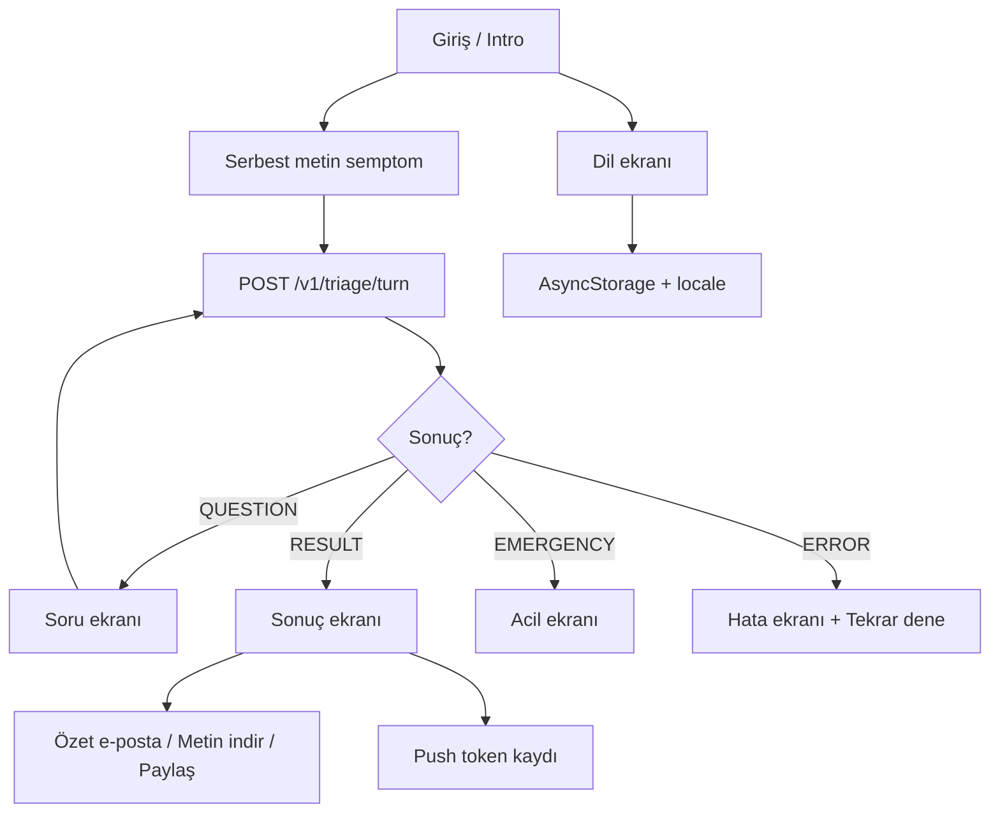

# Mimari özet

Dotshub: ön-triyaj asistanı — backend, mobil (Expo) ve dashboard (Next.js) bileşenleri.

---

## Yüksek seviye akış

---

## Mobil (Expo) akışı

- **i18n:** AsyncStorage + expo-localization; TR/EN/DE/RU/AR; Arapça RTL.
- **API:** triage turn, feedback, send-summary, export-summary, push-token.

---

## Backend endpoint’ler (özet)

| Prefix / Endpoint | Açıklama |
|-------------------|----------|
| `POST /v1/triage/turn` | Oturum başlatma, cevap, sonuç (tek endpoint). |
| `POST /v1/triage/feedback` | Kullanıcı oylaması (up/down). |
| `POST /v1/triage/send-summary` | Özet e-postası (session_id, email, locale). Rate limit: 5/dk (export-summary ile paylaşır). |
| `POST /v1/triage/export-summary` | Özet metin (payload, locale). Rate limit: 5/dk (send-summary ile paylaşır). |
| `POST /v1/triage/push-token` | Expo Push Token kaydı. |
| `GET /v1/facilities` | Tesis keşfi. |
| `GET /health` | Liveness + Supabase durumu. |

---

## Rate limiting ve Redis

Tüm rate limit türleri **tek bir paylaşılan mekanizma** ile çalışır: `REDIS_URL` ayarlı ve Redis erişilebilir olduğunda **Redis** kullanılır; aksi halde process içi **in-memory** (instance başına ayrı sayaç).

| Alan | Limit türü | Amaç |
|------|------------|------|
| `POST /v1/triage/turn`, `POST /v1/triage/feedback` | Cihaz/IP başına (örn. 20/dk) | Triage ve geri bildirim isteklerini sınırlamak |
| `POST /v1/triage/send-summary`, `POST /v1/triage/export-summary` | IP başına (5/dk, paylaşımlı) | E-posta ve export'u sınırlamak |
| `GET/POST /v1/admin/*` | Tenant + IP başına (örn. 60/dk) | Admin API isteklerini sınırlamak |

Limit aşımında HTTP 429 ve `X-RateLimit-*` header'ları dönülür. Detaylı yapılandırma, Redis anahtarları ve çok instance davranışı için: **[RATE_LIMIT_REDIS.md](RATE_LIMIT_REDIS.md)**.

---

## Multi-tenant (Faz 1)

- **Public triage:** Tek tenant. `X-Tenant-Id` yok; tüm triage/feedback/summary `DEFAULT_TENANT_ID` (varsayılan `"default"`) ile çalışır.
- **Admin:** Tenant-aware. `x-admin-key` ile tenant çözülür:
  - `TENANT_ADMIN_KEYS_JSON` tanımlıysa: `{"key1":"tenant1", ...}` → ilgili key ile gelen istekler o tenant’a ait oturum/tuning/istatistikleri görür.
  - Tanımlı değilse: tek `ADMIN_API_KEY` → `DEFAULT_TENANT_ID`.
- **Veri:** `triage_sessions`, `triage_events`, `triage_feedback`, `tuning_tasks` tablolarında `tenant_id`; tüm admin sorguları `tenant_id` ile filtrelenir.
- **Runtime:** `get_runtime(tenant_id)` ile tenant’a göre dataset (`DATASETS_ROOT/<tenant_id>`) ve config (`TENANT_CONFIG_ROOT/<tenant_id>`) yüklenir; Faz 1’de triage her zaman default tenant dataset’ini kullanır.
- **Faz 2 (ileride):** Uygulama içi tenant seçimi, superadmin, cross-tenant veya white-label gelirse `X-Tenant-Id` header’ı eklenir.
- **Testler:** `backend/tests/test_tenant.py` — triage default tenant, admin key → tenant_id, `get_tenant_id_from_admin_key` (rate limit) birim testleri.

---

## Dashboard (Next.js)

- Dashboard, backend admin API’ye proxy yapan `/api/admin/*` route’ları sunar (overview, sessions, stats, export, generate-patch vb.).
- **Yetkilendirme:** Tüm admin proxy route’ları `requireAdmin()` ile korunur: Supabase Auth oturumu ve `admin_users` tablosunda kayıtlı kullanıcı gerekir; aksi halde `/login`’e yönlendirilir. Böylece yalnızca giriş yapmış admin kullanıcılar bu API’leri çağırabilir.

---

## Veri (Supabase)

- **triage_sessions_v5 / triage_sessions:** Oturum kayıtları; send-summary session’ı buradan okur.
- **Feedback / admin tabloları:** Dashboard ve analitik için.

- **Redis:** Rate limit için opsiyonel (yukarıdaki bölüme bakın); diyagramda "Redis opsiyonel" olarak gösterilir.
