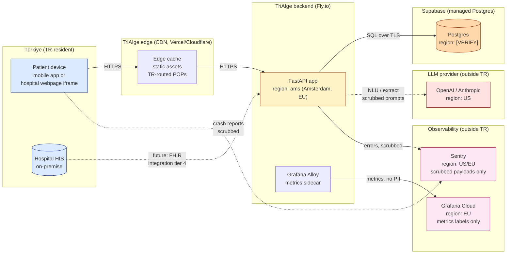

# Reference Architecture — TriAIge

> **Audience.** This document is for a hospital CIO, security architect, or investor's technical due-diligence reviewer. It is the document the founder hands over before the architecture review meeting. It is intentionally stand-alone — a reader should be able to make sense of it without reading any other artifact in this repository.

> **Distinct from `docs/ARCHITECTURE.md`.** That document is the internal engineering reference. This one is the diligence-grade view: emphasis on data flows, regions, encryption, compliance posture, and the open questions the reader must answer for us before integration.

---

## 1. System overview

TriAIge is a pre-triage layer that sits between a patient and a clinician. It accepts free-text symptom input, runs a deterministic emergency-detection layer first, then a budgeted question loop, then returns an explainability-traced specialty recommendation with an urgency envelope. It does not diagnose. It does not prescribe. It does not replace clinical judgment.

The system runs as three components:

- **Mobile app** (Expo / React Native) — patient-facing surface, distributed via Apple App Store and Google Play.
- **Embedded widget** — hospital-website-embeddable iframe, distributed by the hospital's own web team. See [`EMBEDDED_WIDGET_SPEC.md`](EMBEDDED_WIDGET_SPEC.md).
- **Backend API** (FastAPI on Fly.io) — single deterministic policy engine, called by every client surface.

Plus a **dashboard** (Next.js, hospital admin staff) for session review, audit timeline replay, and operational health.

---

## 2. Data-flow diagram

### Cross-border flows (read this carefully)

The diagram above shows three classes of flow that cross the Türkiye border. Each is intentional and has a corresponding control:

1. **Patient → Backend (Fly.io, Amsterdam, EU).** This is the primary cross-border flow. Patient input text leaves Türkiye for an EU-resident server. Control: TLS in transit, encryption at rest, scoped retention, KVKK Aydınlatma disclosure.
2. **Backend → LLM provider (US).** Used for natural-language understanding (NLU) on free-text symptom input. Patient input is sent to the LLM provider. Control: scrubbing pass before egress (`backend/app/observability/sentry_init.py` shares the same key list), provider's no-training-on-data policy verified per provider, this flow is disclosed in the KVKK Aydınlatma Metni and the Hospital DPA. **The patient's free-text DOES traverse this border.** That is the only cross-border flow involving raw patient text. Hospital reviewers must sign off on this explicitly.
3. **Backend / Mobile → Sentry (US/EU).** Crash and error reports. Control: KVKK-safe scrubbing per [`docs/SENTRY_REPLAY_POLICY.md`](../SENTRY_REPLAY_POLICY.md). Free-text patient input is replaced with `[SCRUBBED]` server-side BEFORE the event is transmitted to Sentry. The Sentry payload that crosses the border contains no identifiable patient content — verified quarterly via the operational PII audit.
4. **Backend → Grafana Cloud (EU).** Metrics labels only. No PII; no per-session detail at the metrics layer. Cardinality kept under control via aggregate counters (e.g., `widget_session_started_total{tenant="..."}`).

The flows that DO NOT cross borders:

- Hospital HIS ↔ Hospital infrastructure (stays on-premise; future FHIR integration is hospital-side).
- Audit-trail SQL queries from dashboard ↔ Supabase (Supabase region pending verification, but not US-resident; see §3).

---

## 3. Data residency table

For each class of data the system handles, where it lives and under what controls.

| Data class | Storage | Region | Encryption | Retention |
| ---------- | ------- | ------ | ---------- | --------- |
| Patient symptom text (free-text input) | Supabase Postgres `triage_sessions_v5.user_input_tr` column | `[VERIFY]` — confirm in Supabase dashboard, project settings | TLS in transit; Supabase-managed encryption at rest | `[VERIFY]` — currently undefined operationally; recommended 90 days, configurable per-tenant |
| Session metadata (envelopes, urgency, timestamps) | Supabase Postgres `triage_sessions` table | `[VERIFY]` — same project | TLS in transit; encryption at rest | `[VERIFY]` — recommended 12 months for audit |
| Hashed device IDs | Supabase | `[VERIFY]` — same project | At rest | Per session; not aggregated cross-session |
| Audit event timeline (per-turn events) | Supabase Postgres | `[VERIFY]` | TLS + at-rest | `[VERIFY]` — recommended 12 months |
| Application logs (JSON, structured) | Fly.io managed log storage | `[VERIFY]` — Fly.io stores logs in the machine's region (ams = EU) | TLS in transit | 30 days default Fly.io retention |
| Sentry event payloads (errors + replays) | Sentry SaaS | US/EU (Sentry's choice; pinning to EU requires Sentry Enterprise tier — `[VERIFY]` current tier) | TLS in transit; Sentry-side encryption at rest | 90 days default for replays; 30-90 days for events depending on plan |
| Grafana Cloud metrics | Grafana Cloud SaaS | EU (Grafana Cloud EU-Central endpoint, configured in `fly.toml`) | TLS in transit; Grafana-managed at rest | 13 months default |
| LLM prompt + response (NLU pass) | OpenAI / Anthropic API | US | TLS in transit; provider-side encryption | Provider's data policy — `[VERIFY]` per provider; OpenAI's no-training default keeps payloads ≤ 30 days, Anthropic's similar — re-confirm at contract time |
| Email (summary delivery) | Resend or equivalent transactional email provider | `[VERIFY]` — confirm Resend region | TLS in transit | Email provider's retention — `[VERIFY]` |
| Push notification tokens | Supabase or in-memory log | `[VERIFY]` — currently logged only, not persisted unless tenant opts in | At rest if persisted | Until explicit revocation |
| Mobile crash + replay (Sentry) | Sentry SaaS | Same as above | Same as above | Same as above |

Items marked `[VERIFY]` are flagged honestly because they are not currently documented in the repo to a precision sufficient for a hospital CIO sign-off. Each verification target is named:

- **Supabase region:** confirm in Supabase project dashboard → Settings → General → Region. Strongly recommend pinning to EU-Central (Frankfurt) before signing the first hospital DPA.
- **Sentry region:** confirm in Sentry organization settings. Pin to EU if available on current tier.
- **LLM provider data policy:** confirm at the time of contract negotiation; re-confirm yearly. Both OpenAI and Anthropic publish updated data policies.
- **Resend region:** confirm in Resend dashboard.
- **Push token retention:** define operationally and document in `docs/PUSH_NOTIFICATIONS_POLICY.md` (the policy file already exists; the retention clause is the missing piece).
- **Application log retention:** confirm Fly.io's current retention; configure if longer needed.

---

## 4. Compliance posture

### KVKK (Türkiye — Kişisel Verilerin Korunması Kanunu)

- **Aydınlatma Metni:** mandatory; published at `/kvkk-aydinlatma` on `triaige.com` (see [`WEBSITE_SCAFFOLD.md`](WEBSITE_SCAFFOLD.md) §3) and surfaced in the mobile + dashboard at first launch. Lawful basis: legitimate interest plus, where the patient submits an email summary, explicit consent.
- **Cross-border transfer:** disclosed (the LLM and Sentry flows). The Hospital DPA template ([`docs/templates/KVKK_DPA_TEMPLATE.md`](../templates/KVKK_DPA_TEMPLATE.md)) carries the corresponding clauses; the hospital countersigns the cross-border consent on behalf of patients only after the patient has consented in-app.
- **Data subject rights:** access (return all session rows for a session_id), erasure (`DELETE /v1/me/sessions/{session_id}` exists per CHANGELOG 4.6.0), portability (export-summary endpoint).

### GDPR (EU — General Data Protection Regulation)

- **Lawful basis:** matches KVKK above. Article 6(1)(f) for legitimate interest on the operational telemetry and crash reporting; Article 6(1)(a) consent for the email summary opt-in.
- **Data Protection Impact Assessment (DPIA):** triggered by the AI processing of health-related data. Template under `docs/templates/` (in progress alongside this document).
- **Sub-processors:** Supabase, Sentry, Grafana Cloud, LLM provider, Resend, Vercel, Plausible. Each documented in `/security` page and in the per-hospital DPA.

### No PHI in third-party SaaS

By design, no third-party SaaS receives identifiable patient health information. Implementation:

- The Sentry scrub layer (`mobile/src/observability/sentry.ts::beforeSend` plus `backend/app/observability/sentry_init.py::before_send`) replaces all patient-text-containing fields with `[SCRUBBED]` before transmission.
- The LLM provider does receive raw patient input — this is the primary cross-border flow flagged in §2 above. It is the disclosed exception, not a leak.
- Grafana Cloud receives only metric labels (cardinality-bounded, no patient fields).

### Encryption

- **At rest:** all managed-service storage (Supabase Postgres, Sentry, Grafana Cloud) inherits the provider's at-rest encryption (AES-256 or equivalent). Fly.io machine disks are encrypted at the underlying provider layer.
- **In transit:** TLS 1.2+ on every external connection. Internal `app ↔ agent` traffic on Fly.io's private 6PN mesh — not public Internet, but documented in `fly.toml` as a private flow.
- **Database access:** application connects to Supabase via a service role key stored in `flyctl secrets`; not committed to repo. The `/health` endpoint verifies Supabase reachability without exposing credentials.

### Audit trail

Every triage turn writes a structured event into Supabase. The admin dashboard renders the full event timeline per session — a safety reviewer reproduces a session's behavior without redeploying anything. Cross-reference: [`docs/PITCH.md`](../PITCH.md) "What pilot stakeholders should evaluate" → "Auditability at the session level".

### Erasure mechanism

`DELETE /v1/me/sessions/{session_id}` removes:

- The session row from `triage_sessions_v5`.
- All related event-timeline rows.
- Any feedback rows scoped to the session.

The endpoint is documented in `openapi.yaml` and shipped in CHANGELOG 4.6.0.

---

## 5. Threat model (STRIDE-lite for hospital reviewer)

The format hospital security architects expect: STRIDE categories, our mitigations, where to verify.

### S — Spoofing

**Threat.** An attacker impersonates a legitimate user, an admin, or a tenant to read or write data they should not.

**Mitigations.**

- Admin authentication: Supabase Auth with email + password and admin role check on every admin-scoped route. Per-tenant RBAC.
- Tenant scoping: every database query filters on `tenant_id` server-side; clients cannot influence tenant scope from the request body.
- Widget origin allow-list: only registered hospital origins can embed (frame-ancestors CSP, see [`EMBEDDED_WIDGET_SPEC.md`](EMBEDDED_WIDGET_SPEC.md) §4).

**Verify.** `docs/MULTI_TENANT_REVIEW.md` (sibling document being created in parallel) — when present, it will detail the tenant-scoping invariants and the test matrix that enforces them.

### T — Tampering

**Threat.** An attacker modifies data in transit (man-in-the-middle) or at rest (database compromise) to alter what triage decisions or audit-trail entries the system shows.

**Mitigations.**

- TLS on every external connection. HSTS forced on the public site (`force_https = true` in `fly.toml`).
- Supabase row-level security with admin-only write paths.
- Audit-trail entries are append-only; no UPDATE / DELETE permission on the events table for the application service role except via the explicit erasure endpoint.

### R — Repudiation

**Threat.** A user (patient or admin) denies having taken an action; we cannot prove what happened.

**Mitigations.**

- Per-turn event timeline. Every envelope, every rule firing, every admin action lands as a row with a server-side timestamp.
- The dashboard's session-replay surface lets a reviewer reproduce the exact sequence ([`docs/PITCH.md`](../PITCH.md) "Auditability at the session level").
- Admin actions log into a separate `admin_audit_log` table with the actor's user id.

### I — Information disclosure

**Threat.** Patient data leaks to an unintended audience — through logs, crash reports, third-party tools, or accidental routes.

**Mitigations.**

- Backend PII masker on every log line.
- Sentry scrub layer ([`docs/SENTRY_REPLAY_POLICY.md`](../SENTRY_REPLAY_POLICY.md)) — quarterly audit by operations rotation, with a script (`scripts/sentry_event_pii_scan.py`) for sample verification.
- The widget never posts patient text to its parent (see [`EMBEDDED_WIDGET_SPEC.md`](EMBEDDED_WIDGET_SPEC.md) §3 cross-origin events spec).
- LLM-provider egress is the disclosed exception flagged in §2; documented and consented.

**Verify.** `docs/PII_LEAK_AUDIT.md` (sibling document being created in parallel) — when present, it will document the exhaustive audit and prove the absence of unintended PII flows.

### D — Denial of service

**Threat.** An attacker (or an unintended traffic spike) exhausts the system's capacity, denying service to legitimate hospital users.

**Mitigations.**

- Per-bucket rate limits on the public API (Redis-backed in production, in-memory fallback) — current configuration in [`docs/ARCHITECTURE.md`](../ARCHITECTURE.md).
- Fly.io concurrency limits at the edge (`http_service.concurrency.hard_limit = 100`).
- LLM-provider failover: if primary LLM is down, the orchestrator falls back to the secondary; documented in [`docs/runbooks/LLM_PROVIDER_DOWN.md`](../runbooks/LLM_PROVIDER_DOWN.md).
- Health-alert workflow (`/health` periodic probe, GitHub Actions); on-call rotation per [`docs/OPS_ROTATION.md`](../OPS_ROTATION.md).

### E — Elevation of privilege

**Threat.** A non-admin user (or one tenant's admin) gains access to admin functions or another tenant's data.

**Mitigations.**

- Admin auth boundary enforced server-side on every admin route.
- Tenant scoping enforced in every query (see Spoofing above).
- The dashboard does not embed any admin secret in its bundle; admin operations are authenticated server-to-server with short-lived tokens.

**Verify.** `docs/MULTI_TENANT_REVIEW.md` (sibling, in progress).

---

## 6. Hospital integration shape

Brief overview here; full detail in `docs/HIS_EHR_INTEGRATION.md` (sibling, in progress).

| Tier | Integration shape | Effort on hospital | Effort on TriAIge |
| ---- | ----------------- | ------------------ | ----------------- |
| 1 | Standalone widget on hospital website | One-line iframe | Per-tenant config — see [`EMBEDDED_WIDGET_SPEC.md`](EMBEDDED_WIDGET_SPEC.md) |
| 2 | JS SDK embed (deeper integration, custom UI) | CSP changes + container `
` | SDK build + per-tenant theme |
| 3 | REST API integration (hospital-built UI calls our API) | Hospital-side build | API client docs + auth tokens |
| 4 | FHIR-native (HIS sends/receives FHIR Resources) | HIS vendor cooperation | FHIR adapter — `docs/HIS_EHR_INTEGRATION.md` §FHIR |

Most pilots start at Tier 1 — fastest to deploy, lowest hospital effort, sufficient to demonstrate value. A hospital that signs a multi-year contract typically migrates to Tier 3 or Tier 4 over the first 6–12 months.

---

## 7. Open questions for hospital CIO

The hospital must answer these questions for us before we configure the integration. They are listed in the order they typically come up in the architecture review meeting.

1. **Which HIS / EHR do you operate, and which version?**
   We need this to scope the integration tier, the FHIR conformance level (if Tier 4), and the operational fit. Common Turkish HIS systems: Probel, Akgün, Doruk, Logo HIS — each has its own integration quirks. *We do NOT need to integrate to start a pilot — Tier 1 widget works with no HIS integration at all — but we cannot scope longer-term work without this answer.*

2. **What is your data residency policy?**
   Specifically: must patient data remain inside Türkiye? If yes, we need to discuss the LLM-provider flow (§2 #2) and the Supabase region (§3 `[VERIFY]`) before pilot start. There are paths — e.g., on-premise LLM proxy, EU-Central Supabase pin — but they have cost and latency implications we should plan together.

3. **What is your incident-response SLA expectation?**
   Pilot tier: best-effort, business-hours, 1 business day initial response. Production tiers can match a hospital's 24/7 SLA — but the SLA shape (and the on-call cost it implies) must be agreed up front.

4. **What is your security review process and timeline?**
   Some hospitals run a 2-week security review with their own architects; some require a third-party penetration test before production rollout; some require ISO 27001 from us as a vendor (we are not currently certified — `[VERIFY]` against our roadmap). Knowing the gate up front lets us sequence the pilot accordingly.

5. **What is your cross-border data-flow approval process?**
   The LLM-provider flow and the Sentry flow cross the Türkiye border. Some hospitals require explicit Board-level sign-off on cross-border flows; some require KVKK-Kurulu notification; most require disclosure in the patient-facing Aydınlatma Metni. Knowing your process lets us prepare the right paperwork.

A hospital that can answer these five questions before the architecture review is ready to pilot. A hospital that cannot is one we help work through them — that is part of the engagement.

---

## Related documents

- [`docs/ARCHITECTURE.md`](../ARCHITECTURE.md) — internal engineering architecture; this document is its diligence-grade complement.
- [`docs/PRIVACY_AND_SECURITY.md`](../PRIVACY_AND_SECURITY.md) — privacy posture summary.
- [`docs/SENTRY_REPLAY_POLICY.md`](../SENTRY_REPLAY_POLICY.md) — the canonical record of Sentry's PII handling.
- [`docs/templates/KVKK_DPA_TEMPLATE.md`](../templates/KVKK_DPA_TEMPLATE.md) — the data-processing agreement template referenced in §4.
- [`docs/templates/LOI_TEMPLATE.md`](../templates/LOI_TEMPLATE.md) — pilot agreement template.
- [`docs/runbooks/LLM_PROVIDER_DOWN.md`](../runbooks/LLM_PROVIDER_DOWN.md) — operational runbook referenced in §5 (DoS).
- [`docs/runbooks/SECURITY_INCIDENT.md`](../runbooks/SECURITY_INCIDENT.md) — security-incident response procedure.
- [`docs/OPS_ROTATION.md`](../OPS_ROTATION.md) — operational on-call rotation.
- [`docs/OBSERVABILITY.md`](../OBSERVABILITY.md) — full observability architecture (Prometheus, Grafana, Sentry).
- [`docs/PITCH.md`](../PITCH.md) — product pitch with operational maturity signals.
- [`docs/CHANGELOG.md`](../CHANGELOG.md) — release notes; CHANGELOG 4.6.0 cited in §4 for the erasure endpoint.
- [`docs/brand/WEBSITE_SCAFFOLD.md`](WEBSITE_SCAFFOLD.md) — sibling; `/security` page on the website renders a public-friendly version of this material.
- [`docs/brand/EMBEDDED_WIDGET_SPEC.md`](EMBEDDED_WIDGET_SPEC.md) — sibling; widget security and PII handling cross-referenced from §5.
- `docs/HIS_EHR_INTEGRATION.md` — sibling, being created in parallel; full integration-tier matrix.
- `docs/MULTI_TENANT_REVIEW.md` — sibling, in progress; tenant-scoping invariants for §5 Spoofing + Elevation.
- `docs/PII_LEAK_AUDIT.md` — sibling, in progress; the exhaustive PII audit referenced in §5 Information disclosure.
- `fly.toml` (repo root) — primary region pin; cited in §3 for Fly.io region.
